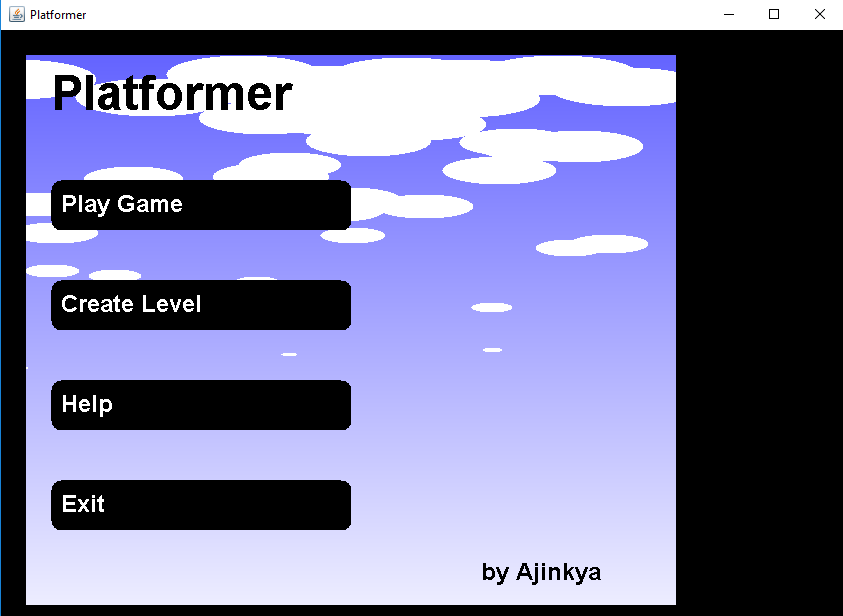
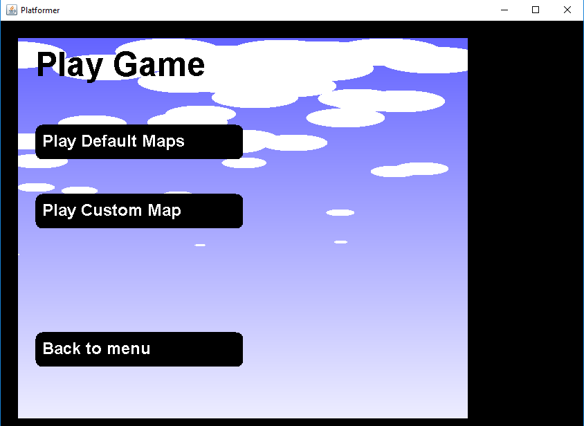
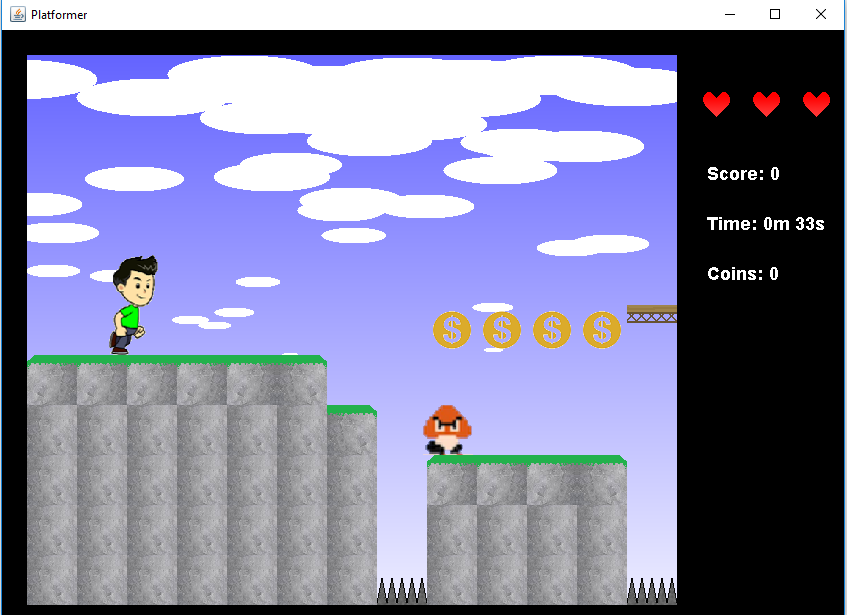
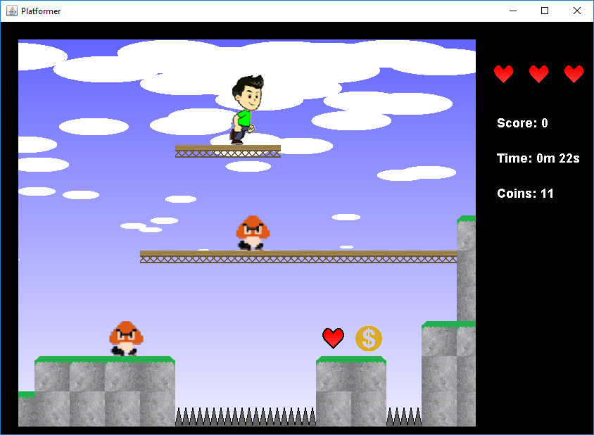
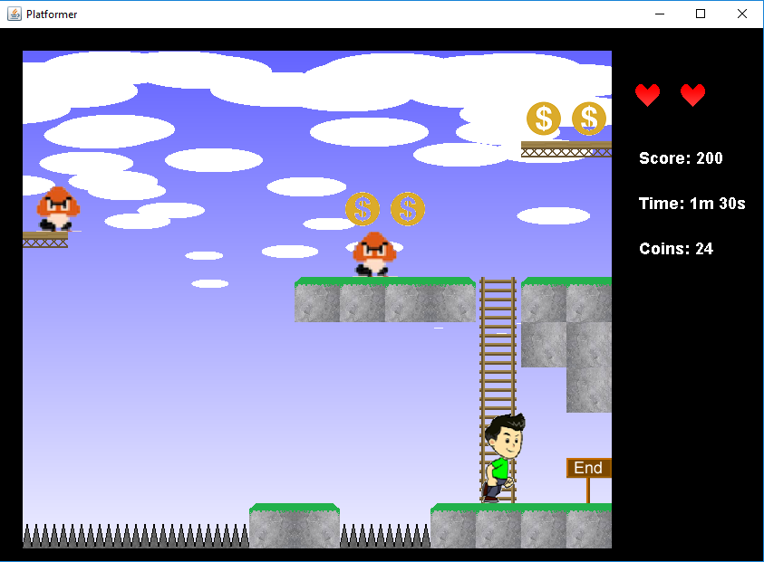

# Dangerous Dave
**Version 1.0.0**

A platform game developed in Java in which you need to reach the end by collecting coins and killing monsters by jumping on them.

### Overview
A project created in Undergrad Computer Engineering class as mini project. 
#### Features
1. 4 default levels  
2. Create new levels
3. Unlimited Fun

Game resources and sprites are downloaded under free license and I do not own any of them.

---
## Rules
1. You have only 3 lives in the beginning. You can collect more in the game.
2. Getting in contact with Gumba or spikes will kill instanlty and you will be spawned at the beginning
3. Ladders will take you up

---
## Game Controls
- Arrow keys to move left and right
- Space bar to jump
- Esc to exit the game

---
## Project Environment
Clone the repository and import into [Intellij IDEA](https://www.jetbrains.com/idea)

---
## Contributors
- Ajinkya Deshmukh <ajinkyad13@gmail.com>

---
## Licence & Copyright
© ajinkyad13

## Screenshots of gameplay

##### Note: The issues in the Create new level section will be fixed soon
